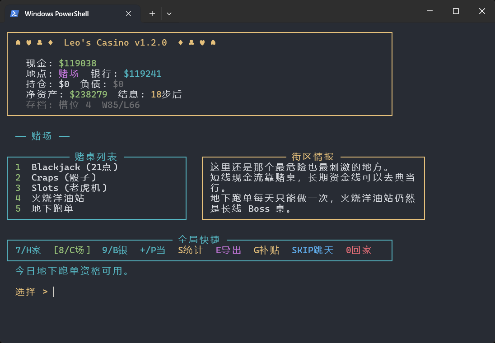

# Casino

一个纯 Python 的终端小赌场项目：你从一笔初始筹码起步，在牌桌、银行、典当行和地下跑单之间来回折腾，尽量把现金流、净资产和运气都撑到最后。



这个仓库的特别之处不只是几个小游戏拼在一起，而是把它们做成了一个持续成长的单人生涯模式：有存档、有资产系统、有贷款压力，也有一条可以用训练模型接管的“火烧洋油站”Boss 线。

## 亮点

- 纯终端体验，主程序只有一个 `casino.py`，开箱就能跑。
- 多种玩法共用同一份角色生涯和统计数据，不是一次性小游戏合集。
- 带 5 个存档槽、自动保存、导出结算和长期统计。
- 有银行存款、日息、分档贷款、政府补贴和破产判定。
- 有“典当行”资产市场，支持持仓、价格波动、消息面和被动收益。
- 有“火烧洋油站”单牌对决模式，支持切换规则 AI、进化式训练模型和 CFR 模型。
- `fire_station_ai/` 是一套独立可训练沙盒，能训练、跑 Arena、生成排行榜并回接主游戏。

## 游戏内容

- `Blackjack`
  经典 21 点，支持分牌、加倍、保险等常见操作。
- `Craps`
  快节奏掷骰玩法，适合短线搏一把。
- `Slots`
  老虎机制，带免费旋转和连胜状态。
- `火烧洋油站`
  单牌心理战玩法，带对手人格、心态和 Boss 推进。
- `地下跑单`
  每日一次的高波动外快事件。
- `银行`
  负责存取款、调安全比率、借款还款和日结息。
- `典当行`
  购买街区资产，吃波动、做仓位、拿被动收入。

## 运行方式

项目目前只用到 Python 标准库，常规 Python 3 环境即可运行。

```bash
python casino.py
```

如果你想单独训练“火烧洋油站”的 AI：

```bash
python -m fire_station_ai.train --preset balanced
python -m fire_station_ai.cfr_train --preset balanced
python -m fire_station_ai.arena --top 6
```

训练生成的模型会被主游戏自动发现，你可以在“火烧洋油站”的决策核心菜单里切换使用。

## 项目结构

- `casino.py`
  主游戏入口，包含终端界面、存档、生涯系统和全部玩法。
- `fire_station_ai/`
  “火烧洋油站”的训练环境、策略运行时、Arena 和批量训练脚本。
- `saves/`
  本地存档目录。
- `exports/`
  导出的生涯结果和统计数据。

`saves/`、`exports/`、`fire_station_ai/runs/` 默认不进 Git，更适合当作本地游玩和实验目录。

## AI 沙盒

`fire_station_ai/` 不是演示性质的小脚本，而是一套能单独跑通的训练工具链，包含：

- 进化式训练
- CFR / regret matching 训练
- 自博弈评估
- 批量训练
- Arena 排行榜
- 静态 HTML 看板

目录里已经有更细的说明，可以继续看 [fire_station_ai/README.md](fire_station_ai/README.md)。

## 适合展示的点

- 终端 UI 做成了完整“地点切换 + 面板式信息 + 长线经营”的游戏结构。
- 玩法不是孤立的，银行、贷款、资产市场和小游戏之间会互相影响。
- AI 训练模块和主游戏做了真实桥接，不是仓库里平行摆着两个互不相干的项目。
- 整体依赖轻，便于别人直接 clone 下来就跑。

## 快速验证

```bash
python -m compileall casino.py fire_station_ai
```

如果你喜欢终端游戏、赔率系统、轻度经营和把 AI 训练结果塞回实际玩法里，这个仓库应该会挺对味。
